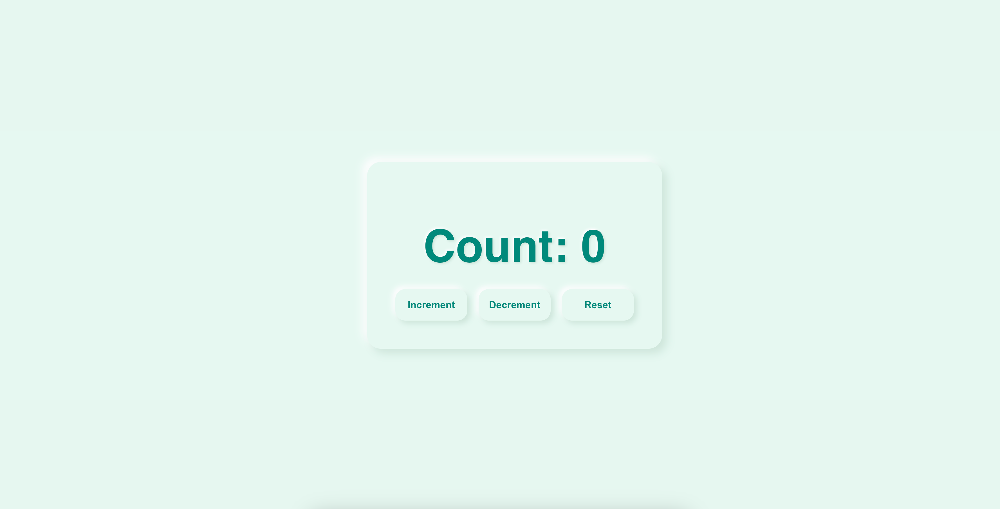

# Basic React Counter Application

A simple and straightforward counter application built with React, demonstrating fundamental concepts like state management and event handling.

## ✨ Features

- **Increment:** Increase the counter's value by one.
- **Decrement:** Decrease the counter's value by one.
- **Reset:** Set the counter's value back to zero.

## 🚀 Technologies Used

- **React:** Used for building the user interface.
- **JavaScript (ES6):** For the application logic.
- **CSS:** For basic styling.

Author: Mounika Pavuluri

GitHub: https://github.com/PavuluriMounika Email: pavulurimounikaa@gmail.com
